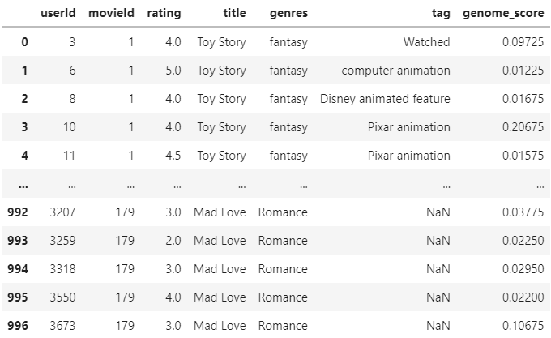
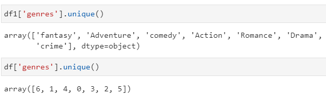
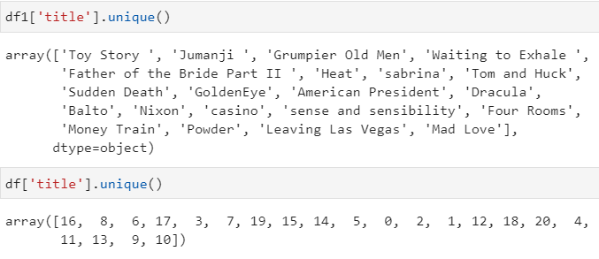
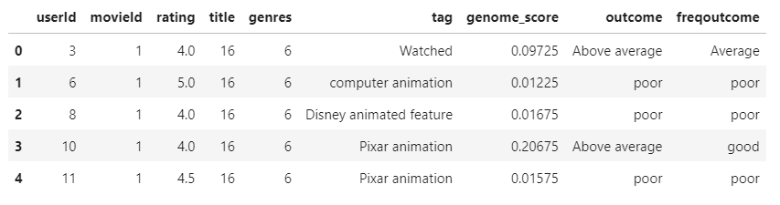
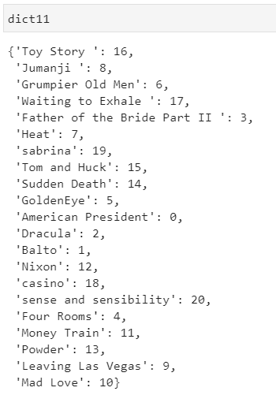
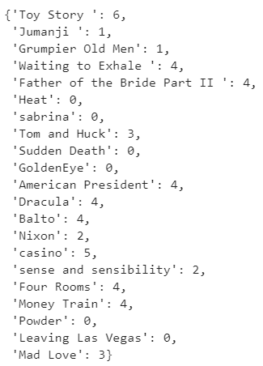
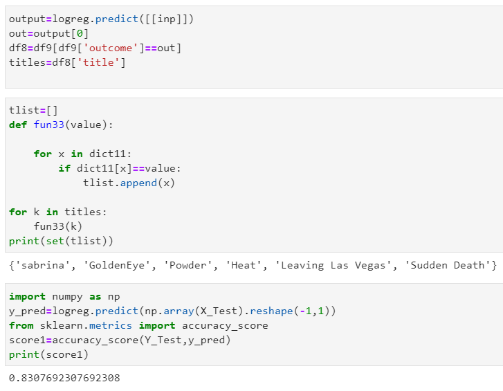
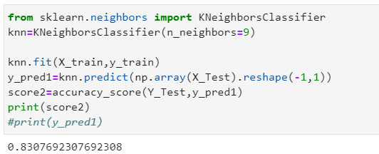

## **Movie rating by using machine learning algorithms**
  


## Description
Movies have been a primary source of entertainment for everyone, most of the people go to the theatres regularly or binge watch them from their personal computers. People spend considerble amount of time searching for a good movie to watch. It is difficult to choose one movie from hundreds of options. But there is huge amount of data in the form of reviews, comments, blogs etc., which help people to choose from. This project is based on recommender systems using machine learning algorithms mainly Multinomial Logistic regression, K Nearest Neighbours and Decision Tree Classifier. With the help of this project  users can search their desired genre movies and pick one with highest rating available. We have a dataset cantaining ratings, genres and titles of different movies, applying the said aalgorithms on this data gives the prediction of best movies in the given genre.

## Support

**Feel free to reach out to me if you have any suggestions or additions you want to add to the project.**

 

**For further detailed information about this project and its repository, refer to the following table.**

## Table of contents
  1. [About this Document](#About-this-document)
  2. [Repository Structure](#Repository-Structure)
  3. [Installation and Implementation](#Installation-and-Implementation)
  4. [Libraries imported](#Libraries-imported)
  5. [Database](#Database)
  6. [Data cleaning and Preparing](#Data-cleaning-and-Preparing)
  7. [Splitting into Training and Testing Data](#Splitting-into-Training-and-Testing-Data)
  8. [Importing algorithm libraries](#Importing-algorithm-libraries)
  9. [Working](#Working)
  10. [Visualizing Results](#Visualizing-Results)
  11. [License](#License)
  12. [Future Ideas](#Future-Ideas)
  13. [Project Status](#Project-Status)


## About this document
- This document contains information about my project on recommender systems for movie suggestions. 
- Understanding and implementation of the project.
- Visual Representation of results and comparision between algorithms.

## Repository Structure
```cpp
-README.md -->> The file you are seeing is called Readme file, it contains all the basic information about the project code, implwmwntation, results and explanation.
-movie rating commented.ipynb -->> It contains the commented code of the discussed project.
-mrating.csv -->> It is a csv dataset file containing all the data that is being worked on with in the project.
 ```
## Installation and Implementation
We can implement this project on Jupyter online notebook which is available in any browser on the internet.
Open this [link](https://jupyter.org/try) and follow the below specified path to get implement the project.

Jupyter online notebook --> Try jupyter lab --> Upload files --> Run files

- Running files is very easy in Jupyter notebook online.
- Place every needed file like the **.ipynb** file and **.csv** file.
- Press the **Start** button and run each cell at-a-time or one cell after the other.
- After every execution we need to restart the kernel by clicking **restart** button. 

## Libraries imported

These libraries are used to downlaod neccessary tools and packages that are needed for this project.
```python
import pandas as pd
import matplotlib.pyplot as plt
import numpy as np
from sklearn.preprocessing import LabelEncoder
from sklearn.model_selection import train_test_split
from sklearn.linear_model import LogisticRegression
from sklearn.metrics import accuracy_score
from sklearn.metrics import classification_report
from sklearn.metrics import confusion_matrix
from sklearn.neighbors import KNeighborsClassifier
from sklearn.tree import DecisionTreeClassifier
```
## Database

- Data is taken from kaggle.com and merged together to form a meaningful dataset as the algorithms used are supervised algorithms, they need the data to be structured and complete to perform well.
- The data is in the form of a .csv file (comma separated values). 
- They are loaded into the model and displayed by implementing the following piece of code.
- The link for dataset from kaggle is given [here](https://www.kaggle.com/grouplens/movielens-20m-dataset?select=movie.csv)
```python
df=pd.read_csv('mrating.csv')
df
```
The dataset contains following fields of data.




## Data cleaning and Preparing
The data we get from internet is incomplete, it is neccessary to clean the data by removing noise like empty cells and filling with meaningful values.
I used label encoder to convert charatcers\strings into numerical form by assigning a unique label to each unique string. Label encoding is neccessary as machine learining algorithms cannot understand characters or strings but numbers/numericals.


**Assigned lables for title and genre column of the dataset.**




Genome score column of the dataset represent the rating of each movie. Based on the genome score, the movies are assigned to one of the categories of __poor, average__ and __good__ and it is labelled as outcome column.



**Connecting lables to titles**
By connecting genre and title labels to each movie, algorithm is able to differentiate each movie with respective to its genre and title.
To do this we use **"dict"** function of python, Dict function is able to store a pair of values called Key/values, by using key value we can get access of value pair.

   

## Splitting into Training and Testing Data

Now at this point, the data is all set and made ready for splitting into training data and testing data. Testing data size is set at 0.25% of the whole dataset, which is considered to be the default training dataset size. Random state generates new samples everytime we run the code.
```python
from sklearn.model_selection import train_test_split
import numpy as np
X_Train, X_Test, Y_Train, Y_Test = train_test_split(X, y, test_size = 0.25, random_state = 0)
```
## Importing algorithm libraries
 The first algorithm to implement is multinomial logistic regression. It is similar to linear regression.

# **Multinomial Regression algorithm**
```python
 logreg = LogisticRegression(C=1e5, solver='lbfgs', multi_class='multinomial') #uses solver ibfg algorithm, class as multinomial algorithm.
X_train=np.array(X_Train).reshape(-1,1) #reshapes the size of the array without changing contents of it.
y_train=np.array(Y_Train).reshape(-1,1) #reshapes the size of the array without changing contents of it.
# Create an instance of Logistic Regression Classifier and fit the data.
logreg.fit(X_train, y_train) #fits the data perfectly for prediction.
```
To view the code in detail goto the file by clicking [here](https://github.com/VijayBarige/Research-Methodology/blob/main/movierating%20commented.ipynb)

# **k-Nearest Neighbours**
For Knn the number of neighbours must be set carefully otherwise the algorithm might not work as expected.
```python
from sklearn.neighbors import KNeighborsClassifier
knn=KNeighborsClassifier(n_neighbors=9)
knn.fit(X_train,y_train)  #fits the data perfectly for prediction.
y_pred1=knn.predict(np.array(X_Test).reshape(-1,1))  #predicts the labels of the vairables in datasets based on the training datasets.
score2=accuracy_score(Y_Test,y_pred1)
```
To view the code in detail goto the file by clicking [here](https://github.com/VijayBarige/Research-Methodology/blob/main/movierating%20commented.ipynb)

# **Decision Tree classifier**
```python
from sklearn.tree import DecisionTreeClassifier
tree=DecisionTreeClassifier()
tree.fit(X_train,y_train)  #fits the data perfectly for prediction.
y_pred2=tree.predict(np.array(X_Test).reshape(-1,1)) #predicts the labels of the vairables in datasets based on the training datasets.
score3=accuracy_score(Y_Test,y_pred2)
print(score3) #Prints the Accuracy of the algorithm.
```
To view the code in detail goto the file by clicking [here](https://github.com/VijayBarige/Research-Methodology/blob/main/movierating%20commented.ipynb)

## Working
 - A movie is given as input manually, here the input given is **Powder**.
 - Label encoders map the movie with a label/numerical value along with genre of the given movie.

```python
inp=fun3('Powder')
mcode=fun4('Powder')
inp,mcode
output: (0, 13)
```
- Here **0** is the genre of the movie which is labelled value for **Action** genre.
- And **13** is the label value of the movie **Powder**
- The trained models are then used to predict the movies similar to that movie.
- A list of movies are given as a suggestion based on the input movie.


## Visualising Results

- This proceddure is performed for all the three algorithms, logistic regression, Knn and Decision Tree classifiers.
- We get three different accuracies for each algorithm, they are similar to eachother with sligth difference.
   

- Graph comparision of accuracies of all three algorithms.


## License
This project requires no license anddd is open for all.

## Future Ideas 
- I want to build this project into a more interacrtive website, so that it can be made available to online users.
- Other algorithms of machine learning can also be tried to see if they can give higher accuracy.

## Project Status
 - The project is prepared to serve the basic puprose for recommending movies.
 - It is designed based on the available dataset and needs redesign at certain parts od code for adapting to anyother structured dataset.
 - It needs to be further developed to be used as a mobile application.


